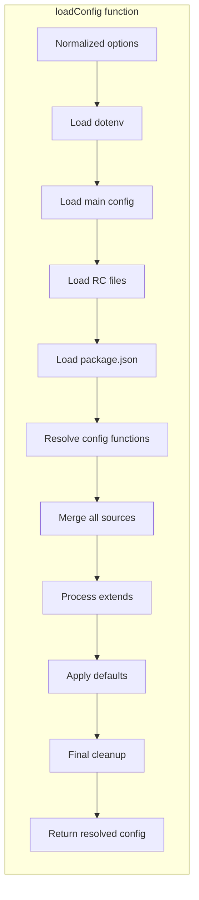
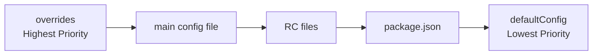
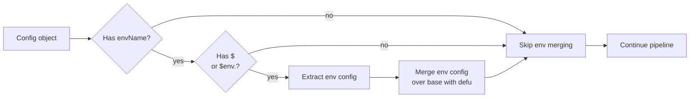
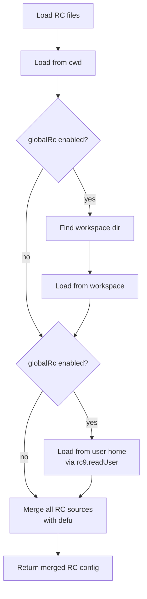
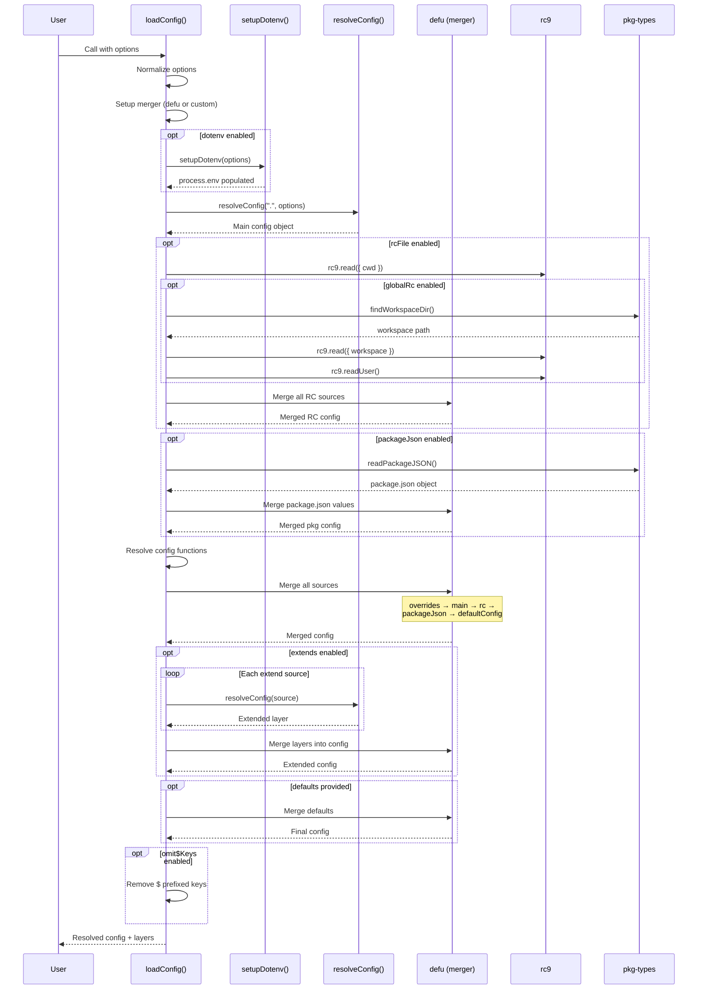

# Configuration Sourcing in c12

This document explains how c12 layers together configuration from various sources, using `defu` for deep merging.

## Overview

c12's configuration loading follows a multi-stage pipeline that sources configuration from multiple locations, merges them using `unjs/defu`, and applies transformations.

## Execution Pipeline

```mermaid
flowchart TD
    Start[Start: loadConfig] --> Normalize[Normalize options]
    Normalize --> SetupMerger[Setup merger<br/>(defu or custom)]
    SetupMerger --> LoadEnv{dotenv enabled?}
    LoadEnv -->|yes| LoadDotenv[Load .env files]
    LoadDotenv --> MainConfig
    LoadEnv -->|no| MainConfig[Load main config file<br/>via resolveConfig]
    MainConfig --> LoadRC{rcFile enabled?}
    LoadRC -->|yes| LoadRcFiles[Load RC files<br/>cwd, workspace, home]
    LoadRcFiles --> MergeRC[Merge RC sources<br/>with defu]
    LoadRC -->|no| PackageJson
    MergeRC --> PackageJson{packageJson enabled?}
    PackageJson -->|yes| LoadPkg[Read package.json]
    LoadPkg --> MergePkg[Merge package.json values<br/>with defu]
    PackageJson -->|no| ResolveFuncs
    MergePkg --> ResolveFuncs[Resolve functions<br/>in rawConfigs]
    ResolveFuncs --> Combine{Main config is array?}
    Combine -->|yes| UseArray[Use array directly<br/>no merging]
    Combine -->|no| MergeSources[Merge sources with defu<br/>overrides → main → rc →<br/>packageJson → defaultConfig]
    MergeSources --> Extend{extends enabled?}
    Extend -->|yes| ProcessExtends[Process extends<br/>recursively]
    ProcessExtends --> MergeLayers[Merge extended<br/>layers with defu]
    Extend -->|no| ApplyDefaults
    MergeLayers --> ApplyDefaults
    ApplyDefaults --> ApplyDefaults{defaults provided?}
    ApplyDefaults -->|yes| MergeDefaults[Merge defaults<br/>with defu]
    ApplyDefaults -->|no| Cleanup
    MergeDefaults --> Cleanup{omit$Keys enabled?}
    Cleanup -->|yes| RemoveDollar[Remove $ prefixed keys]
    Cleanup -->|no| Verify
    RemoveDollar --> Verify{configFileRequired?}
    Verify -->|yes| CheckExists[Check file exists<br/>or throw error]
    Verify -->|no| Return
    CheckExists --> Return[Return resolved config]
```

## Main Config Loading Flow



## Config Sources Priority

When all sources are present, c12 merges them in this order (highest to lowest priority):



The merge happens at `src/loader.ts:158-163`:

```typescript
r.config = _merger(
  configs.overrides,
  configs.main,
  configs.rc,
  configs.packageJson,
  configs.defaultConfig,
) as T;
```

## Where `defu` is Used

`defu` (or a custom merger) is used at several points in the pipeline:

### 1. Main Merger Setup
**Location**: `src/loader.ts:71`
```typescript
const _merger = options.merger || defu;
```

### 2. RC File Merging
**Location**: `src/loader.ts:128`
RC files from cwd, workspace, and home are merged:
```typescript
rawConfigs.rc = _merger({} as T, ...rcSources);
```

### 3. package.json Value Merging
**Location**: `src/loader.ts:140`
Multiple keys from package.json are merged:
```typescript
rawConfigs.packageJson = _merger({} as T, ...values);
```

### 4. Main Source Merging
**Location**: `src/loader.ts:158-163`
All primary config sources are merged:
```typescript
r.config = _merger(
  configs.overrides,
  configs.main,
  configs.rc,
  configs.packageJson,
  configs.defaultConfig,
) as T;
```

### 5. Extended Layers Merging
**Location**: `src/loader.ts:171`
After processing `extends`, all layers are merged into the main config:
```typescript
r.config = _merger(r.config, ...r.layers!.map((e) => e.config)) as T;
```

### 6. Defaults Application
**Location**: `src/loader.ts:194`
Default config has the lowest priority:
```typescript
r.config = _merger(r.config, options.defaults) as T;
```

### 7. Environment-Specific Config Merging
**Location**: `src/loader.ts:418` (in `resolveConfig`)
Env-specific config overrides the base config:
```typescript
res.config = _merger(envConfig, res.config);
```

### 8. Meta Merging
**Location**: `src/loader.ts:423` (in `resolveConfig`)
Meta from source options and config are merged:
```typescript
res.meta = defu(res.sourceOptions!.meta, res.config!.$meta) as MT;
```

### 9. Source Overrides Merging
**Location**: `src/loader.ts:428` (in `resolveConfig`)
Per-source overrides are applied:
```typescript
res.config = _merger(res.sourceOptions!.overrides, res.config) as T;
```

## resolveConfig: Loading Individual Config Layers

The `resolveConfig` function handles loading individual configuration files (including extended configs):

```mermaid
flowchart TD
    Start[resolveConfig start] --> CustomResolver{custom resolver?}
    CustomResolver -->|yes| TryCustom[Try custom resolver]
    TryCustom --> HasResult{result?}
    HasResult -->|yes| ReturnCustom[Return custom result]
    HasResult -->|no| GigetCheck
    CustomResolver -->|no| GigetCheck{giget URI?}
    GigetCheck -->|yes| Download[Download with giget<br/>to local path]
    Download --> NpmCheck
    GigetCheck -->|no| NpmCheck{npm package?}
    NpmCheck -->|yes| ResolvePkg[Resolve npm package]
    ResolvePkg --> LocalImport
    NpmCheck -->|no| LocalImport[Import from local FS]
    LocalImport --> GetExt{has extension?}
    GetExt -->|no| UseDir[Treat as directory<br/>use configFile name]
    GetExt -->|yes| TryResolve
    UseDir --> TryResolve[Try resolve with<br/>multiple paths]
    TryResolve --> FileExists{file exists?}
    FileExists -->|no| ReturnEmpty[Return empty config]
    FileExists -->|yes| CheckFormat
    CheckFormat{Async loader?}
    CheckFormat -->|yes| ParseAsync[Parse with<br/>confbox parsers]
    CheckFormat -->|no| ImportModule[Import module<br/>with jiti fallback]
    ImportModule --> IsFunction{is function?}
    ParseAsync --> IsFunction
    IsFunction -->|yes| CallFunction[Call with context]
    IsFunction -->|no| EnvCheck
    CallFunction --> EnvCheck
    EnvCheck{envName set?}
    EnvCheck -->|yes| MergeEnv[Merge env-specific<br/>config with defu]
    EnvCheck -->|no| MergeMeta
    MergeEnv --> MergeMeta[Merge meta with defu]
    MergeMeta --> SourceOverrides{source overrides?}
    SourceOverrides -->|yes| ApplyOverrides[Apply with defu]
    SourceOverrides -->|no| NormalizePaths
    ApplyOverrides --> NormalizePaths[Normalize paths]
    NormalizePaths --> ReturnResult[Return resolved config]
```



## Environment-Specific Configuration

Each config layer can define environment-specific overrides:



The lookup order for env-specific config is (per `src/loader.ts:413-415`):
1. `config.$<envName>` (e.g., `$production`)
2. `config.$env.<envName>` (e.g., `$env.staging`)

## RC File Loading

RC files are loaded from multiple locations (if `globalRc` is enabled):



RC file loading uses the `rc9` package, which reads from:
1. `cwd/.<name>rc`
2. Workspace root `.<name>rc` (if `globalRc`)
3. User home directory `.<name>rc` (if `globalRc`)

## Extended Configuration Processing

The `extends` feature allows configs to inherit from other configs:

```mermaid
flowchart TD
    Start[extendConfig] --> FindExtends{Has extends key?}
    FindExtends -->|no| End[Return]
    FindExtends -->|yes| ExtractSources[Extract extend sources]
    ExtractSources --> LoopSources[For each source]
    LoopSources --> CheckFormat{Format?}
    CheckFormats -->|{source, options}| Extract2[Extract source/options]
    CheckFormats -->|[source, options]| Extract2
    CheckFormats -->|string| ResolveSource
    Extract2 --> ResolveSource
    ResolveSource --> RemoteCheck{Remote URI?}
    RemoteCheck -->|yes| Download[Download with giget]
    RemoteCheck -->|no| NpmCheck
    Download --> NpmCheck{npm package?}
    NpmCheck -->|yes| ResolvePkg[Resolve package]
    NpmCheck -->|no| LocalPath
    ResolvePkg --> LocalPath[Use local path]
    LocalPath --> ResolveConfig2[Call resolveConfig]
    ResolveConfig2 --> RecursiveExtend[Recursive extendConfig<br/>on base]
    RecursiveExtend --> PushLayer[Push to _layers array]
    PushLayer --> NextSource{More sources?}
    NextSource -->|yes| LoopSources
    NextSource -->|no| MergeLayers[Merge layers<br/>with defu]
    MergeLayers --> End
```

## dotenv Integration

Environment variables are loaded before any config files (per `src/loader.ts:94-100`):

```mermaid
flowchart TD
    Start[setupDotenv] --> LoadFiles[Load .env files]
    LoadFiles --> ParseFiles[Parse with<br/>node:util.parseEnv]
    ParseFiles --> FileRefs{expandFileReferences?}
    FileRefs -->|yes| ExpandFiles[Read _FILE vars<br/>from disk]
    FileRefs -->|no| Interpolate
    ExpandFiles --> Interpolate{interpolate?}
    Interpolate -->|yes| ExpandVars[Expand ${VAR}<br/>references]
    Interpolate -->|no| ApplyToEnv
    ExpandVars --> ApplyToEnv[Apply to process.env]
    ApplyToEnv --> End[Return]
```

The dotenv loading happens **before** any config files, allowing config files to reference environment variables.

## Complete Data Flow



## Key Files

| File | Purpose |
|------|---------|
| `src/loader.ts` | Main `loadConfig()` function and `resolveConfig()` |
| `src/dotenv.ts` | Environment variable loading (`setupDotenv`, `loadDotenv`) |
| `src/types.ts` | TypeScript type definitions |
| `src/watch.ts` | Config watching with file system events |

## Summary

The configuration pipeline in c12 is:

1. **Normalize options** - Set defaults and normalize paths
2. **Load environment variables** - Parse `.env` files and populate `process.env`
3. **Load main config** - Find and import the primary config file
4. **Load RC files** - Read from cwd, workspace, and home directories
5. **Load package.json** - Extract config values from package.json
6. **Merge all sources** - Use `defu` to merge in priority order
7. **Process extends** - Recursively load and merge extended configs
8. **Apply defaults** - Merge lowest-priority defaults
9. **Cleanup** - Remove internal `$` keys if requested

`defu` is the core merging function used throughout the pipeline to ensure deep, predictable merging of configuration objects from all sources.
