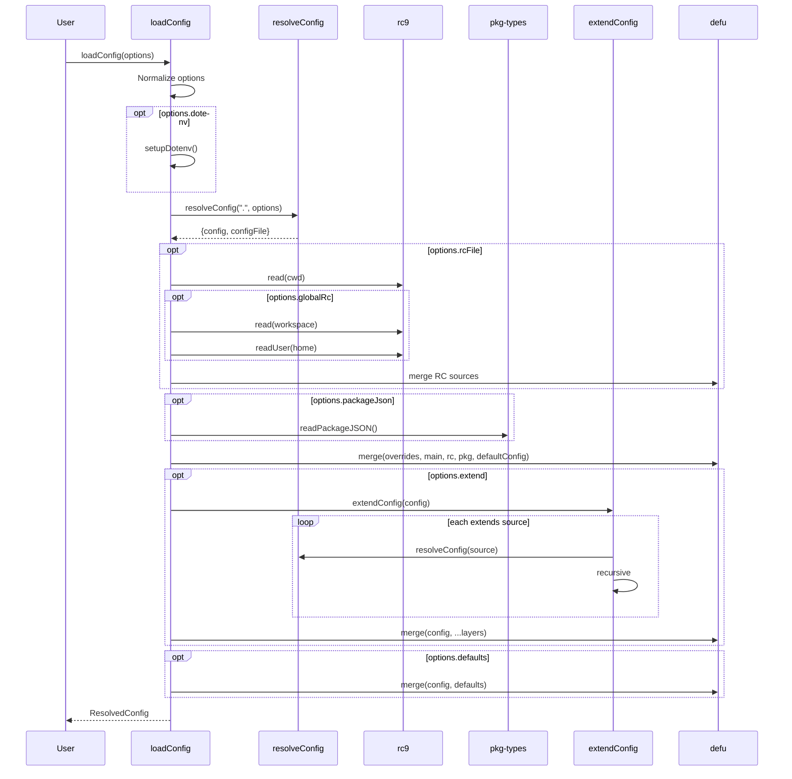
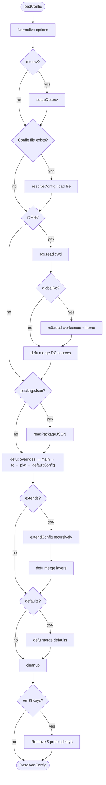

# c12-layer: Configuration Layering Analysis & Enhancement Proposal

## Problem Statement

c12 is a powerful configuration loader, but it has limitations that prevent advanced use cases:

1. **Fixed Pipeline**: Sources are hardcoded (overrides → config file → RC → package.json → defaults). Users cannot inject custom sources or reorder the pipeline.

2. **No Drop-in Directories**: Unlike systemd's `*.conf.d/` pattern, there's no way to have a directory of config fragments merged automatically. See [unjs/c12#298](https://github.com/unjs/c12/issues/298).

3. **No Provenance Tracking**: After merge, it's impossible to know which layer contributed a specific key. Debugging configuration issues requires manual bisection.

4. **Opaque Lifecycle**: The loading process is a black box—no hooks to observe or modify layers before final merge.

### Goals

1. Understand c12's current layering internals
2. Assess feasibility of drop-in directory support
3. Design a layer registry architecture with provenance tracking
4. Identify extension points for backward-compatible enhancements

---

## Findings: How c12 Works Today

### Layer Resolution Order

Priority from highest to lowest, based on [`loader.ts#L157-L164`](src/loader.ts#L157-L164):

| Priority | Source | Code Location |
|----------|--------|---------------|
| 1 (highest) | `options.overrides` | Passed to loadConfig |
| 2 | Main config file (`<name>.config.ts`) | [`L103-L108`](src/loader.ts#L103-L108) |
| 3 | RC files (cwd → workspace → home) | [`L115-L129`](src/loader.ts#L115-L129) |
| 4 | `package.json[name]` | [`L132-L141`](src/loader.ts#L132-L141) |
| 5 | `options.defaultConfig` | Passed to loadConfig |
| 6 | Extended layers (from `extends` key) | [`L167-L172`](src/loader.ts#L167-L172) |
| 7 (lowest) | `options.defaults` | [`L193-L195`](src/loader.ts#L193-L195) |

### Environment-Specific Config

Handled in [`resolveConfig` L411-L420](src/loader.ts#L411-L420):
- Checks for `$development`, `$production`, `$test` based on `options.envName`
- Also checks `$env.{envName}` object
- Merged with **highest priority** on top of the file's base config

### Merge Points

All merges use `defu` (or custom `options.merger`):

| Operation | Location | Code |
|-----------|----------|------|
| RC sources merge | [`L128`](src/loader.ts#L128) | `_merger({}, ...rcSources)` |
| Package.json values | [`L140`](src/loader.ts#L140) | `_merger({}, ...values)` |
| Main 5-source merge | [`L158-L164`](src/loader.ts#L158-L164) | `_merger(overrides, main, rc, packageJson, defaultConfig)` |
| Extended layers | [`L171`](src/loader.ts#L171) | `_merger(config, ...layers.map(e => e.config))` |
| Env-specific | [`L418`](src/loader.ts#L418) | `_merger(envConfig, res.config)` |
| Final defaults | [`L194`](src/loader.ts#L194) | `_merger(config, defaults)` |

### Lifecycle Sequence



### Decision Flowchart



### Existing Extension Points

1. **`options.resolve`** ([`L284-L288`](src/loader.ts#L284-L288)): Custom resolver can intercept any source before default resolution
2. **`options.merger`** ([`L71`](src/loader.ts#L71)): Replace `defu` with custom merge function
3. **`options.import`** ([`L385-L386`](src/loader.ts#L385-L386)): Custom module loader
4. **`extends` key**: Already supports arrays of sources with recursive resolution

### Current Limitations

1. **No insertion points**: Can't add sources between existing ones (e.g., between RC and package.json)
2. **Post-hoc layers**: `ResolvedConfig.layers` preserves sources but only after merge—no pre-merge introspection
3. **No directory scanning**: `resolveConfig` handles single files only
4. **No key-level tracking**: `defu` merges destructively with no provenance

---

## Proposed Solutions

### Solution 1: Drop-in Directory Support

**Problem**: Users want `myapp.config.d/` directories with sorted fragments like `00-base.ts`, `10-local.ts`.

**Approach**: Add a `configDir` source type that scans a directory and sorts files.

```typescript
// New function in loader.ts
async function loadConfigDir<T>(
  dirPath: string,
  options: LoadConfigOptions<T>
): Promise<ConfigLayer<T>[]> {
  const dir = resolve(options.cwd!, dirPath);
  if (!existsSync(dir)) return [];
  
  const entries = await readdir(dir);
  const configFiles = entries
    .filter(f => SUPPORTED_EXTENSIONS.some(ext => f.endsWith(ext)))
    .sort(); // Alphabetical: 00-base.ts < 10-overrides.ts
  
  const layers: ConfigLayer<T>[] = [];
  for (const file of configFiles) {
    const res = await resolveConfig(join(dir, file), options);
    if (res.config) {
      layers.push(res);
    }
  }
  return layers;
}
```

**Integration Options**:

| Option | Where | Behavior |
|--------|-------|----------|
| A. New rawConfigs source | After `main` | `rawConfigs.configDir = loadConfigDir(...)` |
| B. Auto-extend | In `extendConfig` | Treat `.config.d/` as implicit extends |
| C. User-opt-in | Via `options.configDir` | Explicit enable with priority control |

**Recommended**: Option C with priority parameter:
```typescript
loadConfig({
  name: 'myapp',
  configDir: {
    path: 'myapp.config.d/',
    priority: 'after-main' // or 'before-rc', 'after-extends'
  }
})
```

---

### Solution 2: Pluggable Source Providers

**Problem**: Users want custom sources (env vars, remote config, Vault) integrated into the pipeline.

**Approach**: Define a `ConfigProvider` interface and allow registration.

```typescript
// New types
interface ConfigProvider<T = any> {
  name: string;
  priority: number; // Lower = higher priority
  load(options: LoadConfigOptions<T>): Promise<ConfigLayer<T> | null>;
}

// Built-in providers
const builtinProviders: ConfigProvider[] = [
  { name: 'overrides', priority: 0, load: (o) => ({ config: o.overrides }) },
  { name: 'main', priority: 100, load: (o) => resolveConfig('.', o) },
  { name: 'rc', priority: 200, load: loadRcFiles },
  { name: 'packageJson', priority: 300, load: loadPackageJson },
  { name: 'defaultConfig', priority: 400, load: (o) => ({ config: o.defaultConfig }) },
];

// User registration
loadConfig({
  providers: [
    ...defaultProviders,
    { name: 'env', priority: 50, load: envProvider },
    { name: 'vault', priority: 150, load: vaultProvider },
  ]
})
```

**Benefits**:
- Full control over source order
- Clean separation of concerns
- Easy to add/remove/reorder sources

---

### Solution 3: Layer Registry with Two-Phase Execution

**Problem**: No way to inspect layers before merge or trace value provenance.

**Approach**: Separate "build" and "load" phases.

```typescript
// New API
interface LayerRegistry<T> {
  readonly layers: ReadonlyArray<RegisteredLayer<T>>;
  
  // Build phase
  addSource(name: string, source: SourceDefinition): LayerRegistry<T>;
  validate(): Promise<ValidationResult>;
  
  // Introspection (pre-load)
  getLayerByName(name: string): RegisteredLayer<T> | undefined;
  
  // Execution
  load(): Promise<ResolvedConfigWithProvenance<T>>;
}

interface RegisteredLayer<T> {
  name: string;
  priority: number;
  source: SourceDefinition;
  status: 'pending' | 'loaded' | 'not-found' | 'error';
  config?: T;
  configFile?: string;
}

interface ResolvedConfigWithProvenance<T> {
  config: T;
  layers: RegisteredLayer<T>[];
  provenance: Map<string, LayerProvenance>; // key path → which layer
}

interface LayerProvenance {
  layerName: string;
  configFile?: string;
  keyPath: string;
}
```

**Usage**:
```typescript
const registry = createLayerRegistry({ name: 'myapp' })
  .addSource('defaults', { type: 'static', config: { port: 3000 } })
  .addSource('base', { type: 'file', path: 'myapp.config.ts' })
  .addSource('drop-ins', { type: 'directory', path: 'myapp.config.d/' })
  .addSource('env', { type: 'env', prefix: 'MYAPP_' })
  .addSource('cli', { type: 'static', config: cliArgs });

// Validate before loading
const validation = await registry.validate();
if (!validation.ok) {
  console.error('Missing sources:', validation.missing);
}

// Load with provenance
const { config, provenance } = await registry.load();

// Debug: where did database.host come from?
console.log(provenance.get('database.host'));
// → { layerName: 'drop-ins', configFile: 'myapp.config.d/20-database.ts', keyPath: 'database.host' }
```

---

### Solution 4: Provenance-Tracking Merger

**Problem**: `defu` merges destructively—no way to know which layer contributed a key.

**Approach**: Wrap merge with a tracking layer.

```typescript
function createProvenanceMerger<T>() {
  const provenance = new Map<string, LayerProvenance>();
  
  function trackingMerger(
    layerName: string,
    configFile: string | undefined
  ): (...sources: T[]) => T {
    return (...sources) => {
      // Use defu for actual merge
      const result = defu(...sources);
      
      // Track which keys came from which layer
      // (Simplified: real impl would deep-traverse)
      for (const [key, value] of Object.entries(sources[0] || {})) {
        if (value !== undefined && !provenance.has(key)) {
          provenance.set(key, { layerName, configFile, keyPath: key });
        }
      }
      
      return result;
    };
  }
  
  return { trackingMerger, provenance };
}
```

**Deep tracking** would require a recursive merge that records the path for every leaf value.

---

### Solution 5: Backward-Compatible Integration

**Problem**: New features must not break existing `loadConfig()` users.

**Approach**: Layer registry is opt-in; `loadConfig` continues unchanged.

```typescript
// Existing API unchanged
const config = await loadConfig({ name: 'myapp' });

// New API for power users
const registry = await buildLayerRegistry({ name: 'myapp' });
const { config, provenance } = await registry.load();

// Or: loadConfig with provenance opt-in
const { config, provenance } = await loadConfig({
  name: 'myapp',
  trackProvenance: true, // New option
});
```

**Implementation**: Refactor `loadConfig` internals to use registry, but expose existing return type by default.

---

## Implementation Roadmap

### Phase 1: Drop-in Directories
- Add `loadConfigDir()` function
- Add `options.configDir` to `LoadConfigOptions`
- Integrate into layer collection before extends resolution
- **Effort**: Small, self-contained change

### Phase 2: Provider Interface
- Define `ConfigProvider` interface
- Refactor existing sources as built-in providers
- Add `options.providers` for custom sources
- **Effort**: Medium, requires restructuring loader.ts

### Phase 3: Layer Registry
- Create `LayerRegistry` class
- Implement two-phase execution
- Add `buildLayerRegistry()` export
- **Effort**: Large, new module

### Phase 4: Provenance Tracking
- Implement tracking merger
- Integrate with registry
- Add `trackProvenance` option to loadConfig
- **Effort**: Medium, requires careful deep-object traversal

---

## Open Questions

1. **Priority notation**: Should priorities be numeric (0-1000) or named slots (`before-main`, `after-rc`)?

2. **Drop-in merge order**: Should drop-ins merge left-to-right (later files override) or right-to-left (earlier files have priority)?

3. **Provenance granularity**: Track at key level only, or full path (`database.connection.host`)?

4. **Async providers**: How to handle slow providers (Vault, remote config) gracefully?

5. **Caching**: Should registry cache loaded configs for repeated `.load()` calls?
